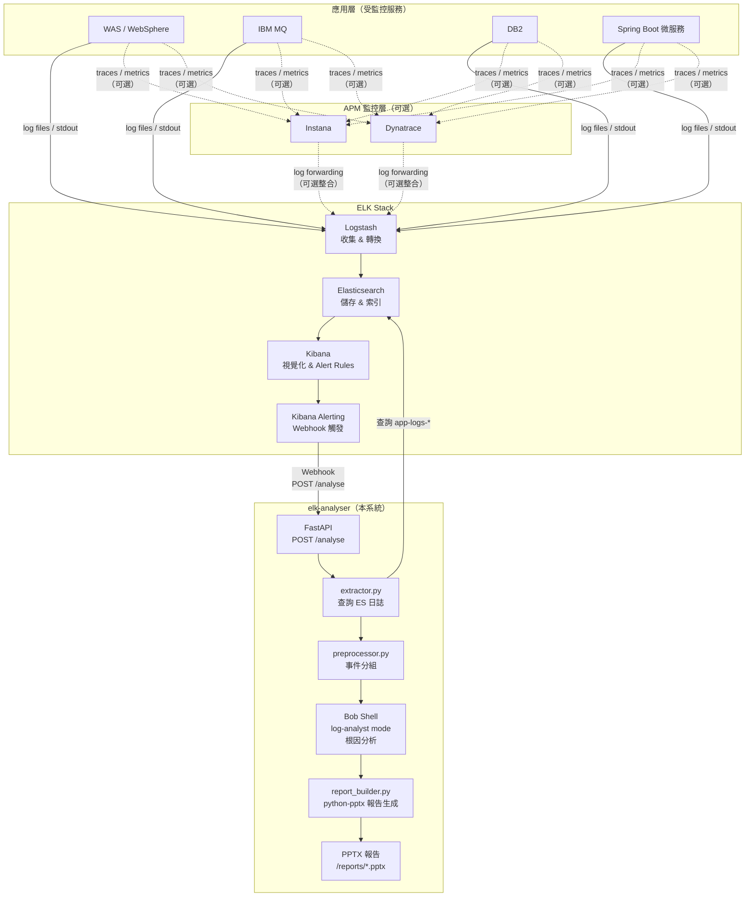

<!-- Updated: 2026-08-26 23:41:32 +0800 -->
# ELK Stack 整合架構說明

本文說明 elk-analyser 在企業日誌監控體系中的定位、與 ELK Stack / APM 工具的關係，以及 Kibana Alerting 觸發分析的正確做法。

---

## 1. 整體架構圖



---

## 2. ELK 與 APM 工具的定位分工

### 常見誤解
「elk-analyser 是抓取 Instana/Dynatrace 收集的 logs 嗎？」

### 正確理解

| 工具 | 定位 | 資料來源 |
|------|------|---------|
| **Logstash** | 日誌收集、轉換、路由 | 應用程式直接輸出（log file、stdout、syslog） |
| **Elasticsearch** | 全文索引儲存 | Logstash 輸入 |
| **Kibana** | 視覺化、Dashboard、Alert Rules 設定 | Elasticsearch |
| **Instana / Dynatrace** | APM（Application Performance Monitoring）| agents 直接安裝在應用服務器 |
| **elk-analyser** | 根因分析與報告生成 | Elasticsearch（查詢 `app-logs-*` 索引） |

**關鍵點：** ELK 與 APM 工具（Instana/Dynatrace）是**並行的兩條資料流**，應用程式同時往兩邊送資料。elk-analyser 的資料來源是 **Elasticsearch**，不是 APM 工具。

若企業希望整合，可透過 Logstash pipeline 把 Instana/Dynatrace 匯出的 logs 再寫入 ES，但這是額外的整合工作，不是預設行為。

---

## 3. Kibana Alerting 觸發分析（主要方式）

### 觸發流程

```
ES 異常日誌出現
      ↓
Kibana Alert Rule 評估（每 N 分鐘）
      ↓ 條件滿足（如 ERROR 數 > 50 in 5 分鐘）
Webhook → POST http://elk-analyser:8080/analyse
      ↓
elk-analyser 自動完成：查詢 → 分析 → 報告生成
```

### Kibana Connector 設定

```
Kibana → Stack Management → Connectors → Create connector → Webhook

URL:    http://elk-analyser:8080/analyse
Method: POST
Headers:
  Content-Type: application/json
```

### Webhook Action Payload

```json
{
  "to_time":          "{{date}}",
  "lookback_minutes": 5,
  "trigger":          "kibana_alert"
}
```

| 欄位 | 說明 |
|------|------|
| `to_time` | Kibana 評估觸發當下時間（`{{date}}`），作為分析視窗結束點 |
| `lookback_minutes` | **必須與 Alert rule 評估視窗長度一致**（rule 評估「過去 5 分鐘」→ 填 `5`）|
| `trigger` | 觸發來源標記，存入 `analysis_jobs.trigger_mode`，方便追蹤 |

elk-analyser 收到後計算：`from_time = to_time - lookback_minutes`，分析範圍精準對應 Alert 評估視窗，不分析多餘日誌。

### 避免重複觸發

在 Kibana Alert rule 設定 throttle（建議與評估視窗相同）：

```
Notify: Every 5 minutes  ← 與評估視窗一致，避免同一異常重複觸發
```

---

## 4. Web UI 手動觸發（維運人員自選時間區間）

維運人員發現問題時，可透過 Web UI 自選時間區間立即觸發分析：

```json
{
  "from_time": "2026-08-26 14:00",
  "to_time":   "2026-08-26 15:00"
}
```

Web UI 帶 `from_time` / `to_time` 時，直接使用指定視窗，不受 Checkpoint 或 `lookback_minutes` 影響。

---

## 5. 查詢視窗解析優先序

`POST /analyse` 的 `from_time` 依以下優先序決定：

| 優先 | 條件 | from_time 來源 |
|------|------|---------------|
| 1 | `from_time` 有值 | 直接使用（Web UI / CLI）|
| 2 | `lookback_minutes` 有值 | `to_time - lookback_minutes`（Kibana Alert）|
| 3 | 兩者皆無，Checkpoint 有值 | Checkpoint 接續上次分析結束時間 |
| 4 | 三者皆無 | `now - config.checkpoint.default_lookback_minutes`（預設 60 分鐘）|

---

## 6. Elasticsearch Watcher（進階 / 備選）

若 Kibana 不可用，或需要複雜查詢條件 / IaC 部署，可改用 Elasticsearch Watcher：

```json
PUT _watcher/watch/elk-analyser-critical-trigger
{
  "trigger": { "schedule": { "interval": "5m" } },
  "input": {
    "search": {
      "request": {
        "indices": ["app-logs-*"],
        "body": {
          "query": {
            "bool": {
              "must": [
                { "terms": { "log.level": ["CRITICAL", "FATAL", "ERROR"] } },
                { "range": { "@timestamp": { "gte": "now-5m", "lte": "now" } } }
              ]
            }
          },
          "size": 0
        }
      }
    }
  },
  "condition": { "compare": { "ctx.payload.hits.total.value": { "gt": 0 } } },
  "throttle_period": "5m",
  "actions": {
    "trigger_elk_analyser": {
      "webhook": {
        "method": "POST",
        "url": "http://elk-analyser:8080/analyse",
        "headers": { "Content-Type": "application/json" },
        "body": "{\"from_time\": \"{{ctx.trigger.scheduled_time}}\", \"to_time\": \"{{ctx.execution_time}}\", \"trigger\": \"es_watcher\"}"
      }
    }
  }
}
```

Watcher 可直接帶入 `ctx.trigger.scheduled_time`（視窗開始）與 `ctx.execution_time`（視窗結束），對應 `from_time` / `to_time`，不需要 `lookback_minutes`。

---

## 7. elk-analyser 連線模式切換

`bob-analyser/config/config.yaml` 中的 `elasticsearch.mode` 控制資料來源：

```yaml
elasticsearch:
  mode: mock      # ← 開發測試用（讀 mock/sample_logs.json）
  # mode: local   # ← 本地 ES（localhost:9200）
  # mode: remote  # ← 正式 ES cluster（需填入連線參數）

  host: "your-es-host.example.com"
  port: 9200
  scheme: "https"
  username: "elastic"
  password: ""    # 建議改用環境變數 ES_PASSWORD
  index_pattern: "app-logs-*"
```

### 正式環境啟用步驟

1. 將 `mode` 改為 `remote`
2. 填入正式 ES 的 `host`、`port`、`scheme`
3. 設定認證（username/password 或 API Key）
4. 確認 `index_pattern` 與實際索引名稱一致（例如 `logstash-*` 或 `filebeat-*`）
5. 在 Kibana 建立 Alert rule + Webhook connector，指向 `http://elk-analyser:8080/analyse`
6. 重啟 container：`podman-compose up -d`

---

## 8. 欄位映射（Field Mapping）

不同 ELK 部署的欄位名稱可能不同，透過 `config.yaml` 的 `field_mapping` 節區設定，**不需修改程式碼**：

```yaml
field_mapping:
  timestamp: "@timestamp"     # 時間欄位
  level:     "log.level"      # 日誌等級（Filebeat 預設）
  # level:   "severity"       # Logstash 自訂欄位範例
  message:   "message"        # 訊息內容
  service:   "service.name"   # 服務名稱
  trace_id:  "trace.id"       # Trace ID（用於事件分組）
  host:      "host.name"      # 主機名稱
```

常見的欄位名稱差異：

| 來源 | level 欄位 | timestamp 欄位 |
|------|-----------|---------------|
| Filebeat（預設） | `log.level` | `@timestamp` |
| Logstash 自訂 | `severity` / `level` | `@timestamp` |
| Instana log export | `level` | `timestamp` |
| Dynatrace log export | `status` | `timestamp` |

---

## 9. 完整端對端測試（正式環境前的驗證）

在切換到 `remote` 模式前，建議先以 `local` 模式搭配本地 ES 驗證端對端流程：

```bash
# 1. 啟動本地 ES（若尚未運行）
docker run -d --name es-test -p 9200:9200 \
  -e "discovery.type=single-node" \
  -e "xpack.security.enabled=false" \
  elasticsearch:8.12.0

# 2. 修改 config.yaml
#    mode: local, host: localhost, port: 9200

# 3. 手動送測試日誌至 ES
curl -X POST "localhost:9200/app-logs-test/_doc" \
  -H "Content-Type: application/json" \
  -d '{"@timestamp":"2026-08-26T10:00:00Z","log.level":"CRITICAL","message":"DB2 connection pool exhausted","service.name":"order-service"}'

# 4. 模擬 Kibana Alert 觸發（帶 lookback_minutes）
curl -X POST http://localhost:8080/analyse \
  -H "Content-Type: application/json" \
  -d '{"to_time":"2026-08-26T10:10:00Z","lookback_minutes":15,"trigger":"kibana_alert"}'

# 5. 或 Web UI 手動觸發（帶完整時間區間）
curl -X POST http://localhost:8080/analyse \
  -H "Content-Type: application/json" \
  -d '{"from_time":"2026-08-26 09:50","to_time":"2026-08-26 10:10"}'

# 6. 確認報告產出
curl http://localhost:8080/jobs?limit=1
```
